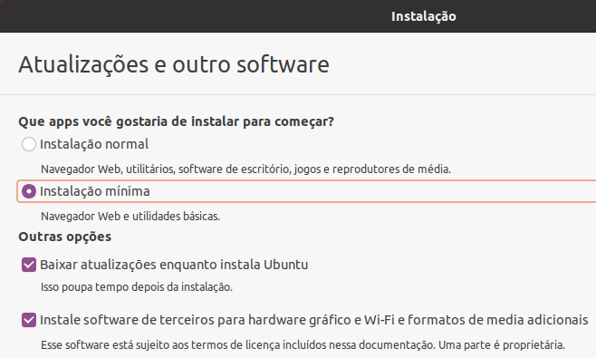
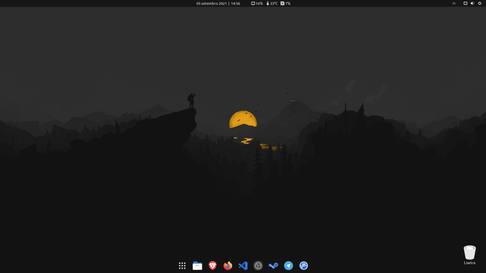

# Pós-Instalação-Ubuntu #

  

Este Script foi desenvolvido para ser utilizado na base 20.04 do Ubuntu, sendo seu uso testado e homologado para o **Ubuntu 20.04.3 Focal Fossa**.

### Observações:

* Recomendado instalação do Ubuntu 20.04.3 no modo "Instalação Mínima".

### Download:

[Pos_Install.sh](https://github.com/ciro-mota/Pos-Instalacao-Ubuntu/raw/master/.files/Pos_Install.sh)

### Extensões GNOME:

- Vitals.
- Clock Override (String: %d %B %Y  |  %H:%M).
- Dash to Dock.
- Hide Activities Button.
- Impatience.
- User Themes.
- Remove Dropdown Arrows.
- Desktop Icons NG (DING).
### Aparência final:

### Ultima Modificação:
>05 Set 2021
