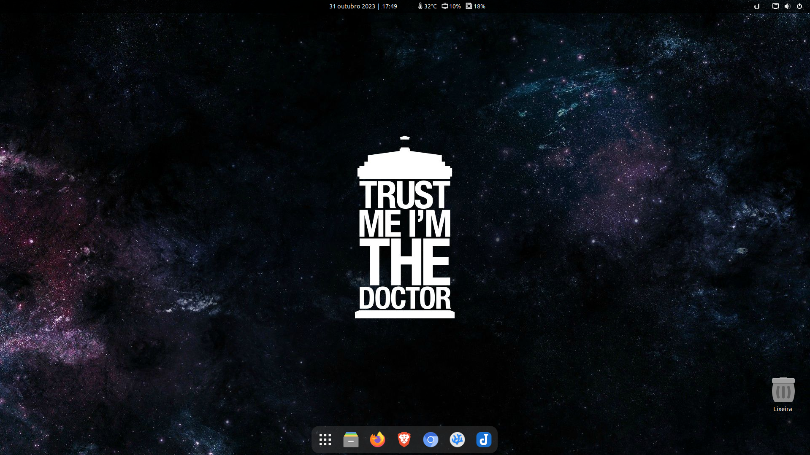

# Script de Pós Instalação


Este script foi desenvolvido com o objetivo de demonstrar a parametrização do meu PC no **Fedora Workstation** que é a minha distro principal no momento. O intuito é construir uma instalação mínima e ir personalizando à medida da necessidade de uso, com instalações de apps apenas via terminal.

É inteiramente livre a cópia caso opte por executá-lo de forma integral ou adaptação para sua necessidade antes da execução, modificando programas que serão instalados nas etapas de repositório, .rpm e Flatpak. Além de servir de inspiração para a construção do seu próprio script de pós instalação.

### Observações:

Scripts para outras distros como Ubuntu, Debian, Manjaro e Arch Linux foram arquivados e receberão apenas atualizações pontuais. Confira [neste link](/arquivo/README.md) recomendações para cada uma delas.

Os scripts disponibilizados são **testados** por mim antes de serem publicados, contudo devido a natureza da diferença entre hardwares e o período quando ocorre as atualizações do script e as atualizações dos sistemas, erros poderão ocorrer na execução. Em sendo, não há garantias plenas do total funcionamento deste script de modo que não me responsabilizo caso haja algum dano material ou de perda de dados.

Peço gentilmente que em caso de erros, reporte-os na guia [Issues](https://github.com/ciro-mota/Meu-Pos-Instalacao/issues) que tentarei o possível para ajudá-lo.

### Extensões GNOME:

- [Vitals](https://extensions.gnome.org/extension/1460/vitals/)
- [Date Menu Formatter](https://extensions.gnome.org/extension/4655/date-menu-formatter/) (String: dd MMMM y | k:mm)
- [Dash to Dock for COSMIC](https://extensions.gnome.org/extension/5004/dash-to-dock-for-cosmic/)
- [Hide Activities Button](https://extensions.gnome.org/extension/744/hide-activities-button/)
- [User Themes](https://extensions.gnome.org/extension/19/user-themes/)
- [Desktop Icons NG (DING)](https://extensions.gnome.org/extension/2087/desktop-icons-ng-ding/)
- [AppIndicator and KStatusNotifierItem Support](https://extensions.gnome.org/extension/615/appindicator-support/)

É possível aplicar uma transparência sem o uso de extensões na barra de tarefas do GNOME, para isso edite o arquivo `gnome-shell.css` do seu tema favorito, localize o conjunto de linhas abaixo:

```css
/* Top Bar */
#panel {
  background-color: rgba(0, 0, 0, 0.7);
```

E modifique o último valor do campo. No meu caso há uma transparência de 0.7, equivalente a 70%.

### Aparência final:



### Ultima Modificação:

> 02 Ago 2022
