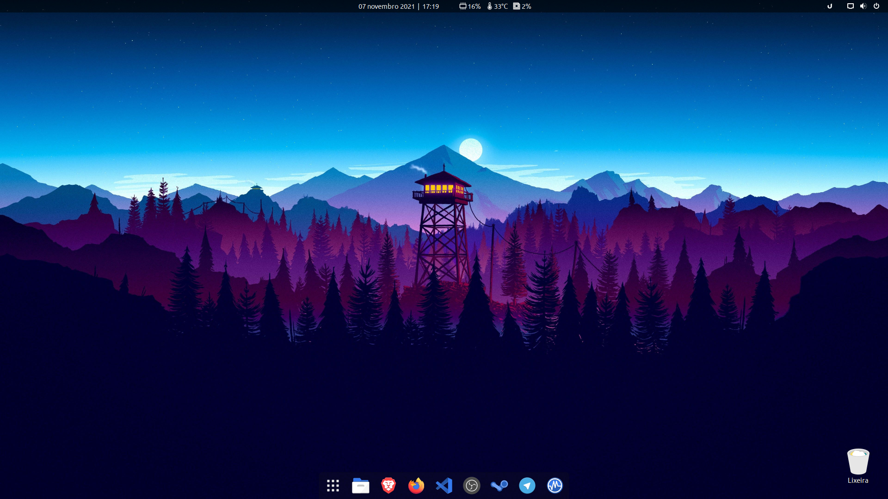

# Minha Pós Instalação

      

Este Git foi desenvolvido com o objetivo de demonstrar a parametrização do meu PC nas principais distros Linux. O intuito é construir uma instalação mínima dessas distros e ir personalizando à medida da necessidade de uso, com instalações de apps apenas via terminal.

É inteiramente livre a cópia caso opte por executá-lo de forma integral ou adaptação para sua necessidade antes da execução, modificando programas que serão instalados nas etapas de repositório, .deb/.rpm, Flatpak e AUR (para Distro Manjaro) e extensões para o VSCode/Codium.

### Observações:

- Recomendado instalação do Ubuntu 20.04.4 LTS no modo **"Instalação Mínima"**.
- Recomendado instalação do Debian Testing no modo **"Net Install"**.
- Recomendado instalação do Fedora Workstation ou Fedora Server escolhendo a opção **"Fedora Workstation"**.
- Recomendado a instalação do Manjaro Linux com a **.iso de instalação mínima**.
- Para o Arch Linux, seguir recomendações de instalação em [anexo](/assets/Arch-Install.md).

### Extensões GNOME:

- [Vitals](https://extensions.gnome.org/extension/1460/vitals/)
- [Date Menu Formatter](https://extensions.gnome.org/extension/4655/date-menu-formatter/) (String: dd MMMM y  |  k:m)
- [Dash to Dock](https://extensions.gnome.org/extension/307/dash-to-dock/)
- [Hide Activities Button](https://extensions.gnome.org/extension/744/hide-activities-button/)
- [Impatience](https://extensions.gnome.org/extension/277/impatience/)
- [User Themes](https://extensions.gnome.org/extension/19/user-themes/)
- [Desktop Icons NG (DING)](https://extensions.gnome.org/extension/2087/desktop-icons-ng-ding/)
- [No overview at start-up](https://extensions.gnome.org/extension/4099/no-overview/)

### Aparência final:

### Ultima Modificação:
>02 Mar 2022
